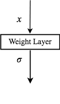
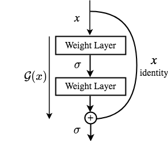
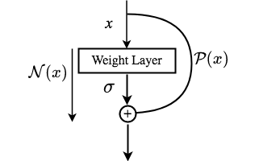

# Physics and Equality Constrained Artificial Neural Networks

Physics-informed neural networks (PINNs) have been proposed to learn the solution of partial differential equations (PDE). In PINNs, the residual form of the PDE of interest and its boundary conditions are lumped into a composite objective function as an unconstrained optimization problem, which is then used to train a deep feed-forward neural network. Here, we show that this specific way of formulating the objective function is the source of severe limitations in the PINN approach when applied to different kinds of PDEs. To address these limitations, we propose a versatile framework that can tackle both inverse and forward problems. The framework is adept at multi-fidelity data fusion and can seamlessly constrain the governing physics equations with proper initial and boundary conditions. The backbone of the proposed framework is a nonlinear, equality-constrained optimization problem formulation aimed at minimizing a loss functional, where an augmented Lagrangian method (ALM) is used to formally convert a constrained-optimization problem into an unconstrained-optimization problem. We implement the ALM within a stochastic, gradient-descent type training algorithm in a way that scrupulously focuses on meeting the constrains without sacrificing other loss terms. Additionally, as a modification of the original residual layers, we propose lean residual layers in our neural network architecture to address the so-called vanishing-gradient problem. We demonstrate the efficacy and versatility of our physics- and equality-constrained deep-learning framework by applying it to learn the solutions of various multi-dimensional PDEs, including a nonlinear inverse problem from the hydrology field with multi-fidelity data fusion. The results produced with our proposed model match exact solutions very closely for all the cases considered


<table>
  <tr>
    <td valign="top"></td>
    <td valign="top"></td>
    <td valign="top"></td>
  </tr>
 </table>
 
 

## Citation
Please cite us if you find our work useful for your research:
```
@article{basir2021physics,
  title={Physics and Equality Constrained Artificial Neural Networks: Application to Partial Differential Equations},
  author={Basir, Shamsulhaq and Senocak, Inanc},
  journal={arXiv preprint arXiv:2109.14860},
  year={2021}
}
```
