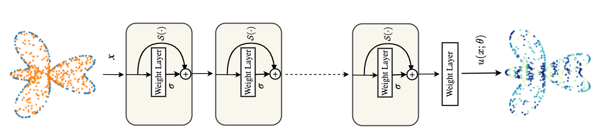
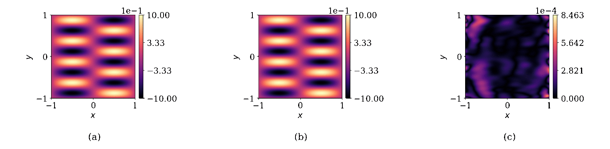

## PECANNs: Physics and Equality Constrained Artificial Neural Networks: Application to Forward and Inverse Problems with Multi-fidelity Data Fusion

### Abstract:
Physics-informed neural networks (PINNs) have been proposed to learn the solution of partial differential equations (PDE). In PINNs, the residual form of the PDE of interest and its boundary conditions are lumped into a composite objective function as soft penalties. Here, we show that this specific way of formulating the objective function is the source of severe limitations in the PINN approach when applied to different kinds of PDEs. To address these limitations, we propose a versatile framework based on a constrained optimization problem formulation, where we use the augmented Lagrangian method (ALM) to constrain the solution of a PDE with its boundary conditions and any high-fidelity data that may be available. Our approach is adept at forward and inverse problems with multi-fidelity data fusion. We demonstrate the efficacy and versatility of our physics- and equality-constrained deep-learning framework by applying it to several forward and inverse problems involving multi-dimensional PDEs. Our framework achieves orders of magnitude improvements in accuracy levels in comparison with state-of-the-art physics-informed neural networks.
#### Paper link : https://doi.org/10.1016/j.jcp.2022.111301




## Codes:
Jupyter notebooks are self-contained. 

##### Required packages
* PyTorch
* numpy 
* scipy 
* matplotlib


## Citation
Please cite us if you find our work useful for your research:
```
@article{PECANN_2022,
title = {Physics and Equality Constrained Artificial Neural Networks: Application to Forward and Inverse Problems with Multi-fidelity Data Fusion},
journal = {J. Comput. Phys.},
pages = {111301},
year = {2022},
issn = {0021-9991},
doi = {https://doi.org/10.1016/j.jcp.2022.111301},
url = {https://www.sciencedirect.com/science/article/pii/S0021999122003631},
author = {Shamsulhaq Basir and Inanc Senocak}
}
```
### Funding Acknowledgment
This material is based upon work supported by the National Science Foundation under Grant No. 1953204 and in part in part by the University of Pittsburgh Center for Research Computing through the resources provided.\
  <br /> 

### Questions and feedback?
For questions or feedback feel free to reach us at senocak@pitt.edu, shb105@pitt.edu, shamsbasir@gmail.com
